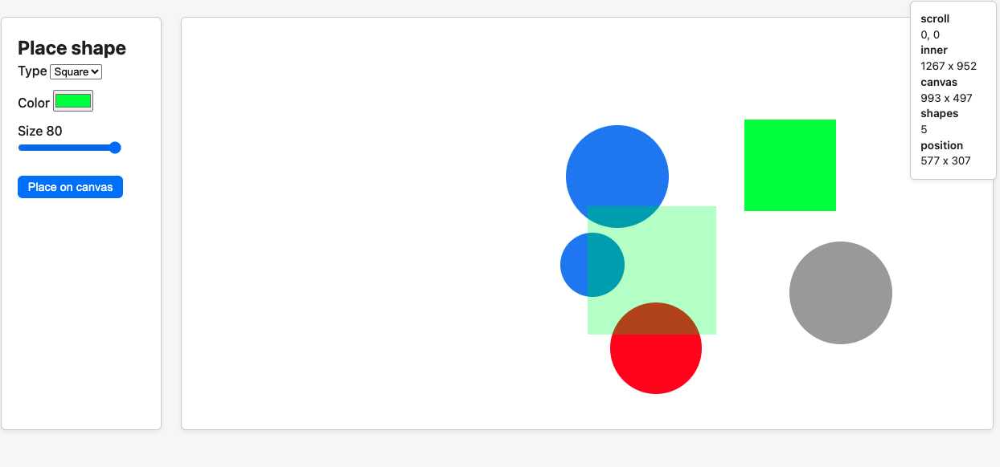
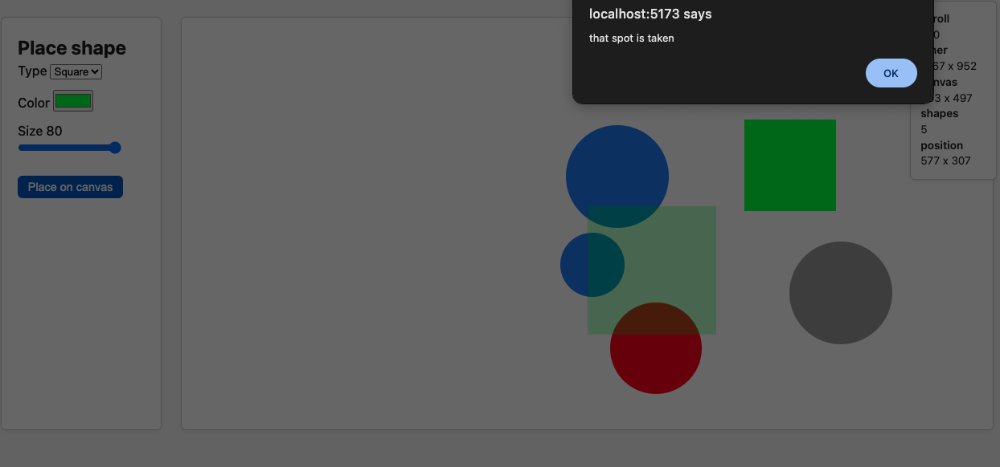

# Razvan Balan 

## Functionalitati implementate
- creare si plasare de forme pe canvas
- customizare culoare, marime si tip forma
- preview plasare
- alert in cazul incercarii de a suprapune formele
- window state in colt cu informatii utile (scroll, marime inner si canvas, pozitie cursor, numar forme asezate)

## Pagina principala

## Pagina alert in caz de suprapunere 

